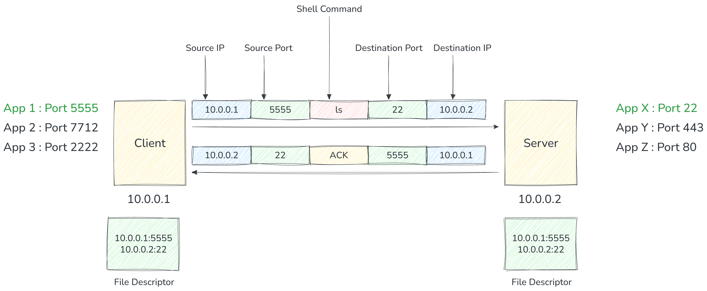
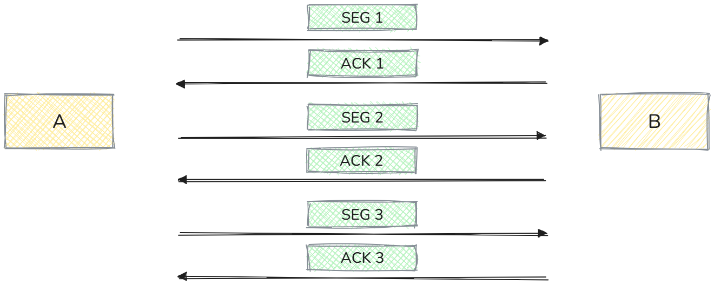
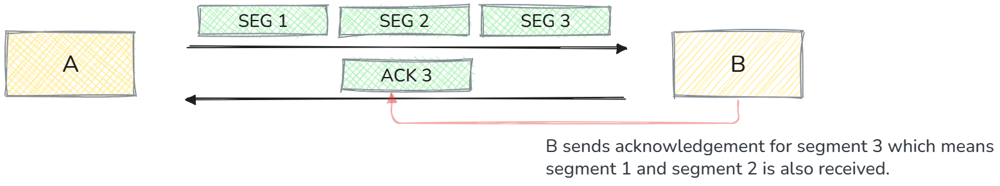
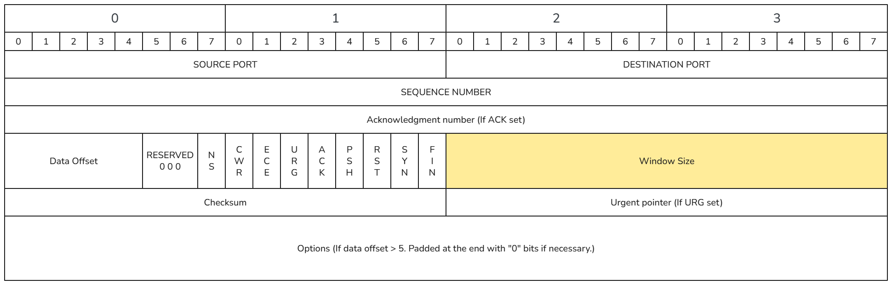
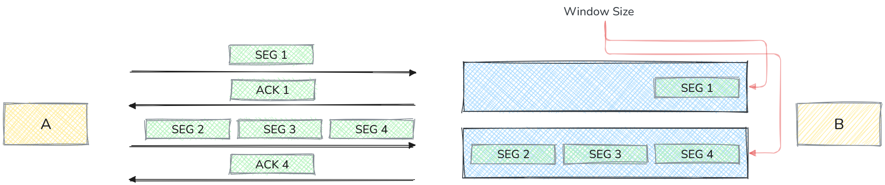
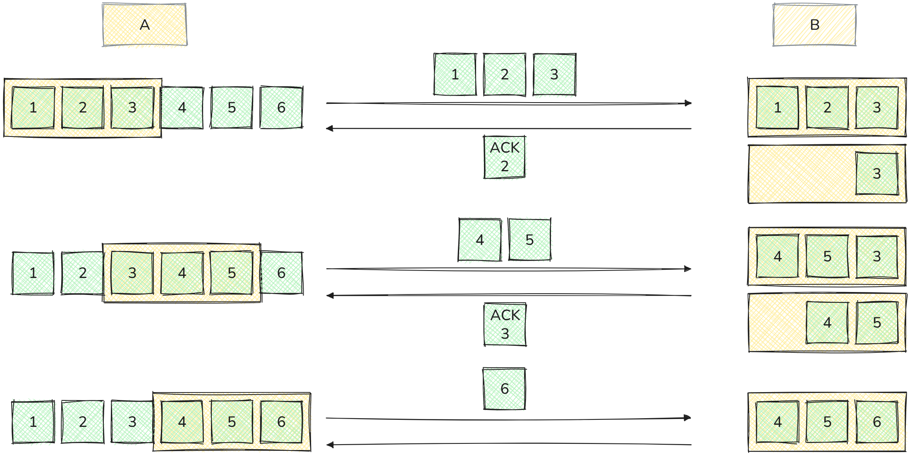
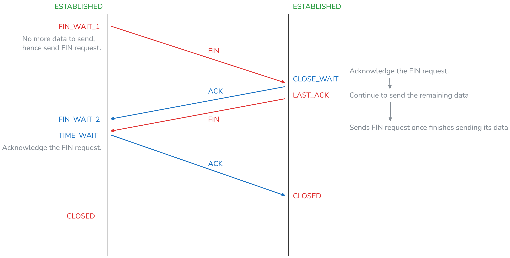

# TCP
- Stands for Transmission Control Protocol.
- It's a layer 4 Protocol (Layer 4 protocols operate at the **transport layer** of the OSI model).
- Ability to address processes in a host using **ports**.
- **Controls** the transmission unlike **UDP** which is a firehose.
- Requires handshake.
- **20** bytes headers segment (can go to 60).
- Stateful.

## TCP Use Cases.
- 🏹 Reliable communication.
- 🏹 Remote shell.
- 🏹 Database connections.
- 🏹 Web communications.
- 🏹 Any bidirectional communication.

## What Is TCP Connection?
A TCP connection refers to a reliable, connection-oriented communication channel established between two endpoints using the **Transmission Control Protocol** at the transport layer. 
It ensures data is delivered in order, without errors or loss, through mechanisms like **handshakes** and **acknowledgments**. 
A connection is identified by 4 properties.
- SourceIP-SourcePort.
- DestinationIP-DestinationPort.

## How TCP Connection Work?
 - App 1 (10.0.0.1) on port **5555** want to send data to App X (10.0.0.2) on port **22**.
 - App 1 sends SYN to App X to synchronous sequence number.
 - App X sends SYN/ACK to synchronous it's sequence number.
 - App 1 ACKs App X SYN.
 - Three way handshake.

### Sending Data.
- App 1 sends data to App X.
- App 1 encapsulate the data in a segment and send it.
- App X acknowledge the segment.

## Flow Control
Flow control refers to the mechanism that ensures a sender does not **overwhelm** a receiver by sending more data than the receiver can process or store in its buffer. It is essential for maintaining reliable communication and preventing packet loss due to buffer overflow.

### How TCP Implements Flow Control.
- **Sliding Window Protocol:** TCP uses a dynamic sliding window mechanism. The receiver advertises a window size (called the receive window) to the sender, indicating how much data it can accept without acknowledgment.
- **Advertised Window:** This value is sent in the TCP header and updated as the receiver processes data. The sender must respect this limit.
- **Dynamic Adjustment:** As the receiver consumes data and frees buffer space, it updates the window size, allowing the sender to transmit more data.

### Flow Control Example - Scenario 1 (Sender Sends Each Segment Synchronously And Wait For Acknowledgment).
- A wants to send 10 segment to B.
- A sends segment 1 to B.
- B acknowledges segment 1.
- A sends segment 2 to B.
- B  acknowledges segment 2.
- **The entire process is extremely slow.**

### Flow Control Example - Scenario 2 (Sender Sends Multiple Segment Parallelly).
- A can send multiple segments and B can acknowledge all in 1 ACK.

- When TCP segments arrive they are put in **receiver's buffer**.
- If we kept sending data the receiver will be overwhelmed, and segments will be dropped. Hence receiver notify sender how much it can handle.

### TCP Window Size
TCP Window Size refers to the amount of data (in bytes) that a TCP sender is **allowed to transmit without receiving an acknowledgment** from the receiver. It is a critical part of TCP’s flow control mechanism.
- Default Limit: Without extensions, the maximum window size is 65,535 bytes.
- Dynamic Nature: The window size can change during a connection based on network conditions and receiver buffer availability.

### Sliding Window.
The sliding window mechanism is the core of TCP’s flow control. It ensures that the sender does not transmit more data than the receiver can handle, while keeping the network link efficiently utilized.
#### How Sliding Window Works.
- Window Concept:
    - The receiver advertises a window size (in bytes) indicating how much data it can accept without acknowledgment.
- Sliding Behavior:
    - As the receiver acknowledges data, the window “slides” forward, allowing the sender to transmit new data.
    - This dynamic adjustment ensures continuous data flow without overwhelming the receiver.
- Key Components:
    - Send Window: Tracks unacknowledged data and new data that can be sent.
    - Receive Window: Advertised by the receiver to control flow.
    - Acknowledgments: Move the window forward as data is successfully received.
 
 

 ### Window Scaling.
TCP originally allowed a maximum window size of **65,535 bytes** (16-bit field in the TCP header). This was sufficient for older networks, but on high-speed, high-latency networks (e.g., gigabit links), this limit severely restricts throughput because the sender cannot keep the pipeline full.
- **Purpose:** Window Scaling is an extension defined in **RFC 1323** that allows TCP to support larger window sizes beyond 65 KB.
- **How It Works:**
    - During the TCP three-way handshake, both sides can negotiate a Window Scale factor.
    - This factor is a power of 2 (from 0 to 14) and is applied as a left shift to the advertised window size.
    - Effective Window Size = **Advertised Window × (2^Scale Factor)**.
- **Benefit:** Enables TCP to use windows up to 1 GB, improving performance on high-bandwidth, high-latency path

## TCP Connection Termination (Close)
Closing a TCP connection is a graceful process that ensures all data is transmitted and acknowledged before the connection ends. It uses a four-step handshake involving the **FIN** and **ACK** flags.

### Steps in TCP Close
**FIN from Initiator**
- The side that wants to close sends a FIN (Finish) segment to indicate it has no more data to send.

**ACK from Receiver**
- The other side acknowledges the FIN with an ACK, but can still send its remaining data.

**FIN from Receiver**
- When the receiver finishes sending its data, it sends its own FIN segment.

**ACK from Initiator**
- The initiator acknowledges this FIN with an ACK, completing the termination.

 

## ✅ TCP Pros
- **Guarantee** Delivery.
- Much more secure than UDP - (No one can send data without prior knowledge).
- Flow Control and Congestion Control.
- **Ordered Packets** no corruption.
- Secure and can't be easily spoofed.
- Inherently supports **retransmission** by default.

## ❌ TCP Cons
- Large header overhead compared to UDP.
- More bandwidth.
- Stateful: consumes memory on server and client.
- Considered high latency for certain workloads.
- Does too much at a low level.
  - Single connection to send multiple streams of data (HTTP requests).
  - Stream 1 has nothing to do with Stream 2.
  - Both Stream 1 and Stream 2 packets must arrive.
- TCP Meltdown
  - Not a good candidate for **VPN**.

Note:
How TCP is Different from WebSockets.
